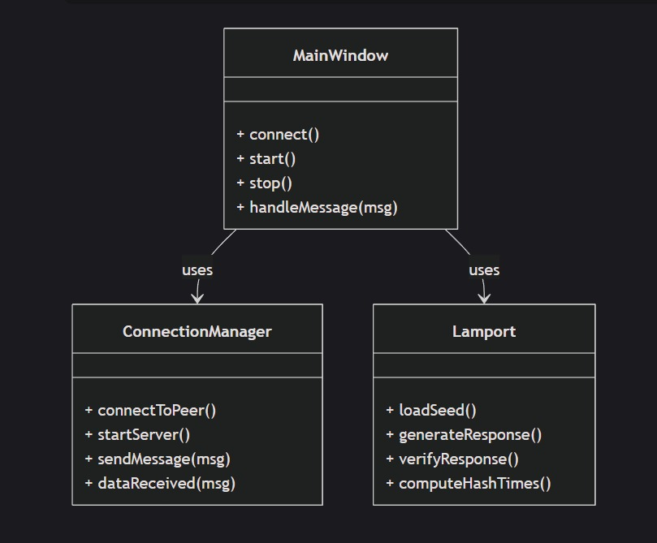
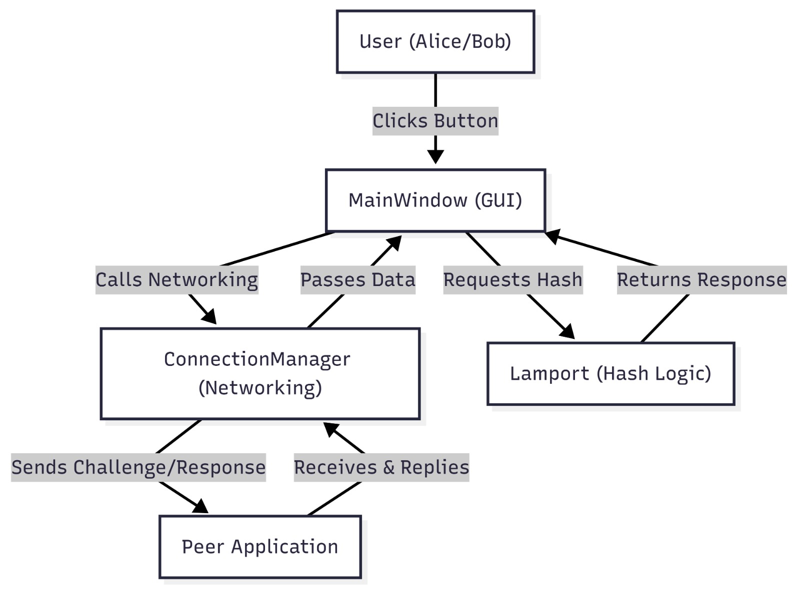

# 🔐 Lamport Authentication Demonstration 

A desktop application developed in C++ that provides a detailed, graphical demonstration of **Lamport's one-way hash-chain based authentication protocol**. This project serves as an educational tool to visualize the entire challenge-response flow between two parties, "Alice" (the authenticator/server) and "Bob" (the user being authenticated/client), as they communicate over a standard TCP network.

---

## 1. Project Details

* **University:** Indian Institute of Information Technology Allahabad
* **Course:** Cyber Security
* **Submitted To:** Dr. Soumyadev Maity
* **Group:** B13

---

## 2. Features

* **Intuitive Graphical User Interface:** A clean and responsive GUI built with Qt Widgets, featuring full protocol control (Connect, Start, Stop, Disconnect).
* **Real-World Client-Server Networking:** Accurately simulates a client-server architecture using `QTcpServer` and `QTcpSocket` for asynchronous communication.
* **Cryptographically Secure Hashing:** The core of the Lamport protocol is implemented using the robust Crypto++ library, employing the **SHA-256** algorithm.
* **Highly Configurable:** All network and protocol parameters are managed in external `app.ini` files, allowing the app to run on different machines without recompiling.
* **Real-time Timestamped Logging:** A detailed log window on both GUIs displays all protocol messages with millisecond-precision timestamps.

---

## 3. Tech Stack & Prerequisites

This project was built using a combination of high-performance and industry-standard tools. The following are required to build the project:

| Component         | Technology / Library                                                                    |
| ----------------- | --------------------------------------------------------------------------------------- |
| **Language** | C++17                                                                                   |
| **GUI/Network** | [Qt 6.9.2+](https://www.qt.io/download) (Widgets + Network)                              |
| **Cryptography** | [Crypto++](https://www.cryptopp.com/) (Installed via vcpkg)                               |
| **Build System** | [CMake 3.21+](https://cmake.org/download/)                                               |
| **Compiler** | [Visual Studio 2022 Build Tools (MSVC)](https://visualstudio.microsoft.com/downloads/)    |
| **Package Manager** | [vcpkg](https://github.com/microsoft/vcpkg)                                             |

---

## 4. Core Concepts Explained

### Lamport's Hash Chain Protocol

The security of the protocol is based on a **one-way hash chain**. It's easy to compute forward, but computationally infeasible to reverse.

-   **Start with a random seed:** `h0`
-   **Compute the chain:** `h1 = H(h0)`, `h2 = H(h1)`, ..., `hn = H(h_{n-1})`
-   **Setup:** Bob (the prover) keeps the secret `h0`. Alice (the verifier) only stores the final `hn`.
-   **Authentication:** For a challenge `c`, Bob replies with `r = h_{n-c}`. Alice verifies this by checking if `H(r)` equals her currently stored hash. If it matches, she updates her stored hash to `r` for the next round.

### Class Diagram

The application's architecture emphasizes a strong separation of concerns, isolating the UI, networking, and cryptographic logic.


* **`MainWindow`:** The central controller. It manages the GUI, handles user input, controls the networking, and drives the state of the Lamport protocol.
* **`HashChain`:** The dedicated cryptographic engine. It acts as an abstraction layer over the Crypto++ library to build the chain and provide responses.



### Data Flow Diagram (DFD)

This diagram shows how data moves through the system during a single round of authentication.



1.  **Challenge:** Alice sends a challenge $c$ to Bob.
2.  **Response:** Bob uses $c$ to find the correct hash $h_{n-c}$ in his pre-computed chain and sends it back.
3.  **Verification:** Alice computes $H(h_{n-c})$ and checks if it matches her stored value. If it does, the round is successful.

## 5. Project Structure

```

.
├── src/
│   ├── main.cpp
│   ├── mainwindow.h / mainwindow.cpp   \# GUI + protocol logic
│   ├── lamport.h / lamport.cpp         \# Hash chain implementation
├── CMakeLists.txt                      \# Build configuration
├── CMakePresets.json                   \# Build presets for VS Code/Visual Studio
├── Alice/                              \# Runtime folder for Alice
│   └── app.ini
├── Bob/                                \# Runtime folder for Bob
│   └── app.ini
└── build/                              \# Out-of-source build directory

````

---

## 6. Installation & Setup (Beginner's Guide)

This guide will walk you through every step to get the project working on a Windows 10/11 machine. Don't worry if you've never done this before; just follow along carefully.
### ⚙️ Installation & Setup (A Step-by-Step Guide)

This guide will walk you through every step to get the project working on a Windows 10/11 machine. Just follow along carefully, and you'll have it running in no time.

#### Step 1: Install the Main Tools 

First, we need to install the main software packages that our project is built with.

**A. Visual Studio 2022**
This is the main program where all our C++ code will be assembled and turned into a runnable application.

1.  Go to the [Visual Studio Community 2022 download page](https://visualstudio.microsoft.com/downloads/) and get the free "Community" version.
2.  Run the installer. A window with a "Workloads" tab will appear.
3.  You **must** check the box for **"Desktop development with C++"**. This is the most important step as it installs the C++ compiler.
    
4.  Click "Install" in the bottom right and wait for it to finish.

**B. Qt 6 Framework**
This is the library that lets us create the graphical user interface (buttons, windows) and handle all the network communication.

1.  Go to the [Qt Online Installer download page](https://www.qt.io/download-qt-installer).
2.  Download and run the installer. You will need to create a free Qt account to log in and proceed.
3.  When you get to the "Select Components" screen:
    * Check the box for a recent version under "Qt", like **`Qt 6.x.x`**.
    * Expand that version by clicking the little arrow next to it, and make sure the box for **`MSVC 2022 64-bit`** is checked.
    * Scroll down to the "Developer and Designer Tools" section and make sure the **`CMake`** box is checked.
4.  Click "Next" and complete the installation.

#### Step 2: Install the Crypto++ Library

Now we'll install the special library for the SHA-256 hashing using a helper tool called `vcpkg`. Think of `vcpkg` as an app store just for C++ libraries.

1.  **Open PowerShell:** Click your Start Menu, type `PowerShell`, and press Enter.
2.  **Install `vcpkg`:** Copy and paste these commands into PowerShell one at a time. Press Enter after each one.
    ```powershell
    # Go to your main user folder (like C:\Users\YourName)
    cd ~

    # Use Git to download vcpkg
    git clone https://github.com/Microsoft/vcpkg.git

    # Go into the new vcpkg folder
    cd vcpkg

    # Run the script to set up the vcpkg tool
    ./bootstrap-vcpkg.bat
    ```
3.  **Install Crypto++:** Now, tell `vcpkg` to get our crypto library. This command will automatically download, build, and install it. This step might take a few minutes.
    ```powershell
    ./vcpkg install cryptopp:x64-windows
    ```

#### Step 3: Download and Configure the Project Code

Now we download our project's code and tell it where to find the tools we just installed.

1.  **Clone the project:** In the same PowerShell window,  run this command:
    ```powershell
    git clone https://github.com/Cyber-Security-July-Dec-2025/B13.git
    cd B13
    ```
2.  **Configure the "GPS" file (`CMakePresets.json`):**
    * Open the project folder in Windows File Explorer.
    * Find the file `CMakePresets.json` and open it with a simple text editor like Notepad.
    * You need to edit two paths in this file so the project knows where to find `vcpkg` and `Qt`.
        * **For `CMAKE_TOOLCHAIN_FILE`:** Find the full path to `vcpkg.cmake` on your computer. It's usually `C:\Users\YourUser\vcpkg\scripts\buildsystems\vcpkg.cmake`.
        * **For `CMAKE_PREFIX_PATH`:** Find the full path to your Qt MSVC folder. It's usually `C:\Qt\6.x.x\msvc2022_64`.
    * Paste the full paths into the file
        ```json
        "CMAKE_TOOLCHAIN_FILE": "C:/Users/YourUser/vcpkg/scripts/buildsystems/vcpkg.cmake",
        "CMAKE_PREFIX_PATH": "C:/Qt/6.4.2/msvc2022_64"
        ```
    * Save and close the file.

#### Step 4: Build the Project (Create the .exe file)

This is the final step where we turn all the code into a runnable program.

1.  **Open Visual Studio 2022.**
2.  On the welcome screen, choose **"Open a local folder"**.
3.  Navigate to and select the `lamport-auth-qt` project folder you downloaded.
4.  Visual Studio will start configuring the project. Wait for a "CMake generation finished" message to appear in the **Output** window at the bottom.
5.  Near the top of the window, you'll see a dropdown menu. Select **`msvc-release`** from this menu.
6.  Go to the main menu at the top of the screen and click **`Build > Build All`**.
7.  Wait for the build to complete. You will see a "Build succeeded" message in the Output window.

---

### 🚀 Usage Guide


#### Step 1: Prepare the "Alice" and "Bob" Folders

The demo needs two separate copies of the app to run at the same time.

1.  In your main project folder, create two new folders: `Alice` and `Bob`.
2.  Go to the build output folder (`build/msvc-release/Release/`) and copy the `LamportAuthQt.exe` file.
3.  Paste the `.exe` file into **both** the `Alice` and `Bob` folders.
4.  **Copy necessary DLL files:** The `.exe` file needs some helper files from Qt to run. The easiest way to get them is to use a tool Qt provides.
    * Open a Command Prompt (search for `cmd` in the Start Menu).
    * Navigate to your `Alice` folder (e.g., `cd C:\path\to\project\Alice`).
    * Run the following command (adjust the path to your Qt installation):
        ```cmd
        "C:\Qt\6.4.2\msvc2022_64\bin\windeployqt.exe" LamportAuthQt.exe
        ```
    * Repeat this process for the `Bob` folder. This will automatically copy all the required `.dll` files.

#### Step 2: Configure the `app.ini` Files

Each app instance needs its own instruction manual.

1.  Inside the `Alice` folder, create a new text file and name it `app.ini`. Paste the following configuration into it:
    ```ini
    [general]
    role=Alice
    n=100
    sleep_ms=1000
    
    [network]
    listen_ip=127.0.0.1
    listen_port=5001
    peer_ip=127.0.0.1
    peer_port=0
    
    [values]
    hn=<copy hn printed by Bob>
    h0=
    ```
2.  Inside the `Bob` folder, create another `app.ini` file and paste this configuration:
    ```ini
    [general]
    role=Bob
    n=100
    sleep_ms=1000
    
    [network]
    listen_ip=127.0.0.1
    listen_port=0
    peer_ip=127.0.0.1
    peer_port=5001
    
    [values]
    h0=ac949be6c57cb92458d5e84bb3645445522f04f5f9a354aa88dbd80ed5dc16ee
    hn=
    ```

#### Step 3: Run the Demonstration

1.  **Run Bob once to get the `hn` value:**
    * Go into the `Bob` folder and double-click `LamportAuthQt.exe`.
    * The log window will show a line that says `Bob computed hn=...`. Copy this long string of letters and numbers.
    * Open `Alice/app.ini` and paste this value after `hn=`. Save the file.
    * You can now close Bob's application.
2.  **Start the real demo:**
    * Go into the `Alice` folder and run `LamportAuthQt.exe`. Click the **Connect** button. Her status will show she is "listening".
    * Go into the `Bob` folder and run `LamportAuthQt.exe`. Click the **Connect** button. Both windows should now show "Connected".
    * In **Alice's window**, click the **Start** button.
    * You will now see the challenge-response messages appearing in both windows, proving the authentication is working!

## 8\. Example Log

**Alice's Log:**

```
[HH:mm:ss.zzz] Alice started. Will run up to 99 rounds (n-1).
[HH:mm:ss.zzz] SEND challenge c=1
[HH:mm:ss.zzz] RECV response r=e6a7712fd9cc953b...
[HH:mm:ss.zzz] SEND ack ok=1
```

**Bob's Log:**

```
[HH:mm:ss.zzz] Bob computed hn=4dfdc93c6a10bf5c...
[HH:mm:ss.zzz] RECV challenge c=1
[HH:mm:ss.zzz] SEND response for c=1 (r=e6a7712fd9cc953b...)
[HH:mm:ss.zzz] RECV ack ok=1
```

-----

## 9\. Future Improvements

  * **Auto-synchronize `hn`:** Automatically send `hn` from Bob to Alice upon the first connection to simplify setup.
  * **Encrypted Transport:** Implement TLS support via OpenSSL to protect the communication channel from eavesdropping.
  * **Session Management:** Allow sessions to be paused and resumed.

-----

## 10\. References

  * Lamport, L. (1981). *Password Authentication with Insecure Communication*.
  * [Crypto++ Library Website](https://www.cryptopp.com/)
  * [Qt Framework Documentation](https://doc.qt.io/)